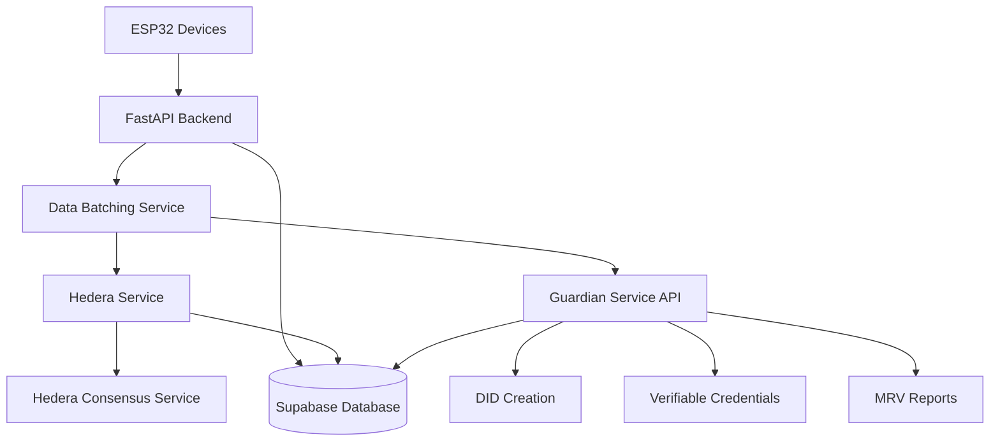
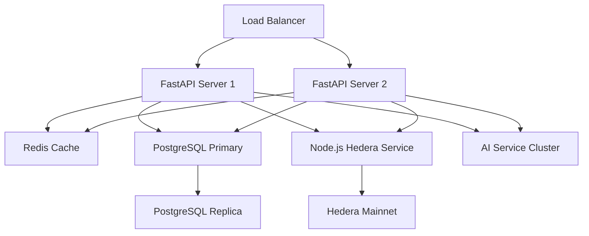

# Design Document

## Overview

The Hedera Verifiable Proof system creates an immutable, publicly auditable record of energy generation data by batching ESP32 readings, cryptographically signing them, and anchoring proofs to the Hedera Consensus Service (HCS). An autonomous AI agent processes this verified data to automate the MRV (Monitoring, Reporting, and Verification) process for carbon credit issuance.

## Architecture

### High-Level Architecture



### System Components

1. **Data Batching Service**: Aggregates ESP32 readings into optimal batches with Guardian metadata
2. **Hedera Service**: Handles HCS interactions and proof anchoring via Node.js microservice
3. **Guardian Integration Layer**: DID management, data submission, and Verifiable Credential handling
4. **Proof Storage**: Database layer for digital birth certificates and Guardian participant data
5. **API Layer**: RESTful endpoints for proof queries, Guardian integration, and system monitoring

## Components and Interfaces

### 1. Data Batching Service

**Purpose**: Efficiently aggregate energy readings for cost-effective HCS submissions and Guardian reporting

**Key Classes**:
- `EnergyBatch`: Container for grouped energy readings
- `BatchProcessor`: Manages batch creation and optimization
- `BatchScheduler`: Handles time-based and size-based triggering
- `GuardianDataFormatter`: Formats energy data for Guardian submission

**Interfaces**:
```python
class IBatchProcessor:
    def add_reading(self, reading: EnergyReading) -> None
    def create_batch(self) -> EnergyBatch
    def should_process_batch(self) -> bool
    def format_for_guardian(self, batch: EnergyBatch) -> dict
```

**Batch Criteria**:
- Size threshold: 1000 readings OR 1 hour time limit
- Compression: GZIP compression before hashing
- Validation: Data integrity checks before batching
- Guardian Formatting: Simple energy summary for Guardian submission

### 2. Hedera Service

**Purpose**: Interface with Hedera Consensus Service for proof anchoring

**Implementation Options**:
1. **REST API Integration**: Use Hedera Mirror Node REST API for queries and Hedera JSON-RPC for transactions
2. **Node.js Microservice**: Create a Node.js service using @hashgraph/sdk and expose REST endpoints
3. **Direct gRPC**: Interface directly with Hedera nodes using gRPC (requires protobuf definitions)

**Recommended Approach**: Node.js microservice with REST API wrapper

**Key Classes**:
- `HederaClient`: REST client for Node.js microservice communication
- `ProofAnchor`: Cryptographic proof structure
- `TransactionManager`: HTTP-based transaction handling with retry logic

**Interfaces**:
```python
class IHederaService:
    def submit_proof(self, batch_hash: str, metadata: dict) -> HCSTransaction
    def query_proof(self, transaction_id: str) -> ProofRecord
    def verify_proof(self, data: bytes, proof_record: ProofRecord) -> bool
```

**Node.js Microservice Endpoints**:
```javascript
// POST /api/hcs/submit-message
// GET /api/hcs/transaction/{transactionId}
// GET /api/hcs/topic/{topicId}/messages
```

**Guardian Integration Endpoints**:
```python
# POST /api/guardian/create-participant
# GET /api/guardian/participant/{did}/status
# POST /api/guardian/link-energy-data
# GET /api/guardian/participants
```

**Frontend Endpoints**:
```python
# POST /api/participants/register  # Simple form: name + email
# GET /api/participants/status/{did}
# GET /api/participants/list
```

**Proof Structure**:
```json
{
  "batch_id": "uuid",
  "data_hash": "sha256_hash",
  "device_count": 5,
  "reading_count": 1000,
  "timestamp_range": {"start": "iso_date", "end": "iso_date"},
  "metadata": {"version": "1.0", "compression": "gzip"},
  "guardian_integration": {
    "participant_did": "did:hedera:testnet:participant-id",
    "emission_reductions": 10.5,
    "verification_method": "AMS-I.D"
  }
}
```

**Guardian DID Creation Request**:
```json
{
  "participant_name": "Green Energy Morocco Ltd",
  "email": "contact@greenenergy.ma",
  "role": "Project_Participant"
}
```

**Guardian DID Response**:
```json
{
  "did": "did:hedera:testnet:participant-id",
  "status": "created",
  "email_sent": true,
  "guardian_form_url": "https://guardian.app/complete-profile/participant-id"
}
```

**Energy Data Submission to Guardian**:
```json
{
  "participant_did": "did:hedera:testnet:participant-id",
  "energy_batch": {
    "batch_id": "uuid",
    "total_energy_kwh": 1500.5,
    "device_count": 5,
    "timestamp_range": {"start": "2024-01-01", "end": "2024-01-02"}
  },
  "hedera_verification": {
    "proof_anchor": "hcs_transaction_id",
    "consensus_timestamp": "2024-01-01T00:00:00Z",
    "data_hash": "sha256_hash"
  }
}
```

### 3. Guardian Integration Layer

**Purpose**: Interface with Guardian Service for DID management and data submission

**Key Classes**:
- `GuardianClient`: HTTP client for Guardian Service API interactions
- `GuardianDataMapper`: Maps energy batch data to Guardian-compatible format
- `DIDManager`: Decentralized Identifier management
- `ParticipantManager`: Guardian participant profile management

**Interfaces**:
```python
class IGuardianIntegrator:
    def create_participant_did(self, participant_name: str, email: str = None) -> GuardianDIDResponse
    def submit_energy_data(self, batch: EnergyBatch, hedera_proof: ProofAnchor) -> GuardianResponse
    def get_participant_status(self, did: str) -> GuardianParticipantStatus
    def link_energy_data_to_participant(self, did: str, batch_id: str) -> GuardianResponse
```

**Guardian Integration Capabilities**:
- Simple DID creation with just participant name through Guardian Service API
- Guardian sends email to participant for profile completion
- Energy data submission to Guardian projects once participant completes profile
- Hedera proof anchor embedding in Guardian submissions
- Automated linking of verified energy data to Guardian participants

### 4. Proof Storage Layer

**Purpose**: Persistent storage for digital birth certificates and audit trails

**Database Schema**:
```sql
-- Proof anchors table
CREATE TABLE proof_anchors (
    id UUID PRIMARY KEY,
    batch_id UUID UNIQUE,
    hcs_transaction_id VARCHAR(255),
    consensus_timestamp TIMESTAMP,
    data_hash VARCHAR(64),
    batch_metadata JSONB,
    created_at TIMESTAMP DEFAULT NOW()
);

-- Batch contents table  
CREATE TABLE batch_contents (
    id UUID PRIMARY KEY,
    batch_id UUID REFERENCES proof_anchors(batch_id),
    device_id VARCHAR(255),
    reading_data JSONB,
    original_timestamp TIMESTAMP,
    batch_position INTEGER
);

-- Guardian submissions table
CREATE TABLE guardian_submissions (
    id UUID PRIMARY KEY,
    batch_id UUID REFERENCES proof_anchors(batch_id),
    participant_did VARCHAR(255),
    energy_data JSONB,
    hedera_proof_reference VARCHAR(255),
    submission_status VARCHAR(50),
    guardian_response JSONB,
    submitted_at TIMESTAMP DEFAULT NOW()
);

-- Guardian participants table
CREATE TABLE guardian_participants (
    id UUID PRIMARY KEY,
    participant_did VARCHAR(255) UNIQUE,
    participant_name VARCHAR(255),
    contact_email VARCHAR(255),
    profile_completion_status VARCHAR(50) DEFAULT 'pending',
    guardian_email_sent BOOLEAN DEFAULT FALSE,
    created_at TIMESTAMP DEFAULT NOW(),
    updated_at TIMESTAMP DEFAULT NOW()
);
```

## Data Models

### Core Data Structures

```python
@dataclass
class EnergyReading:
    device_id: str
    timestamp: datetime
    power: float
    voltage: float
    current: float
    total_energy_kwh: float
    metadata: Dict[str, Any]

@dataclass
class EnergyBatch:
    batch_id: str
    readings: List[EnergyReading]
    created_at: datetime
    compressed_data: bytes
    data_hash: str

@dataclass
class ProofAnchor:
    batch_id: str
    hcs_transaction_id: str
    consensus_timestamp: datetime
    data_hash: str
    verification_status: str

@dataclass
class GuardianParticipantRequest:
    participant_name: str
    email: str  # Optional for notification
    created_at: datetime

@dataclass
class GuardianVerifiableCredential:
    id: str
    type: List[str]
    issuer: str
    credentialSubject: List[Dict[str, Any]]
    hedera_proof_anchor: str
    consensus_timestamp: datetime
    batch_id: str

@dataclass
class GuardianSubmission:
    batch_id: str
    participant_did: str
    energy_data: Dict[str, Any]
    hedera_proof_reference: str
    submission_status: str
    guardian_response: Dict[str, Any]
    submitted_at: datetime
```

## Error Handling

### Hedera Service Error Handling

1. **Connection Failures**: Exponential backoff retry with circuit breaker
2. **Transaction Failures**: Automatic retry up to 3 attempts
3. **Insufficient Balance**: Alert administrators and queue transactions
4. **Network Timeouts**: Fallback to backup Hedera nodes

### Data Integrity Protection

1. **Batch Corruption**: Checksum validation before HCS submission
2. **Missing Readings**: Gap detection and reporting
3. **Device Failures**: Automatic device health monitoring
4. **Timestamp Issues**: Server-side timestamp normalization

### Guardian Integration Error Handling

1. **Guardian API Failures**: Exponential backoff retry with circuit breaker
2. **DID Creation Errors**: Queue participant registration for retry
3. **Data Submission Failures**: Store failed submissions for manual review
4. **Authentication Issues**: Automatic token refresh and re-authentication

## Testing Strategy

### Unit Testing

1. **Batching Logic**: Test batch creation, compression, and hashing
2. **Hedera Integration**: Mock HCS interactions and test retry logic
3. **Guardian Integration**: Test DID creation and data submission with mock Guardian API
4. **Data Models**: Validate serialization and database operations

### Integration Testing

1. **End-to-End Flow**: ESP32 → Batch → Node.js Service → HCS → Guardian
2. **Hedera Testnet**: Real HCS transactions via Node.js microservice with test data
3. **Guardian Testnet**: Real Guardian API interactions with test participant data
4. **Performance Testing**: High-volume batch processing through REST API
5. **Failure Scenarios**: Network failures, Node.js service outages, HCS connectivity issues, Guardian API failures

### Security Testing

1. **Cryptographic Verification**: Hash integrity and proof validation
2. **API Security**: Authentication and authorization testing
3. **Data Privacy**: Ensure no sensitive data in public proofs
4. **Access Control**: Verify proper permission enforcement

## Performance Considerations

### Scalability Targets

- **Throughput**: 10,000 energy readings per minute
- **Batch Processing**: Sub-second batch creation
- **HCS Latency**: 3-5 second consensus finality
- **AI Analysis**: Real-time processing for standard batches

### Optimization Strategies

1. **Batch Compression**: GZIP compression reduces HCS costs by ~70%
2. **Parallel Processing**: Concurrent batch processing for multiple devices
3. **Caching**: Redis cache for frequently accessed proofs
4. **Database Indexing**: Optimized queries for proof lookups

### Resource Management

1. **Memory Usage**: Streaming batch processing to minimize RAM
2. **Storage Optimization**: Compressed historical data archival
3. **Network Efficiency**: Connection pooling for HCS interactions
4. **CPU Utilization**: Async processing for I/O-bound operations

## Security Architecture

### Cryptographic Security

1. **Hash Algorithm**: SHA-256 for data integrity
2. **Digital Signatures**: Ed25519 signatures for proof authenticity
3. **Key Management**: Hardware Security Module (HSM) for private keys
4. **Proof Verification**: Public key cryptography for third-party validation

### Access Control

1. **API Authentication**: JWT tokens with role-based permissions
2. **Device Authentication**: X.509 certificates for ESP32 devices
3. **Admin Access**: Multi-factor authentication for system administration
4. **Audit Logging**: Comprehensive access and operation logging

### Data Protection

1. **Encryption at Rest**: AES-256 for sensitive database fields
2. **Encryption in Transit**: TLS 1.3 for all network communications
3. **Data Minimization**: Only essential data in public proofs
4. **Privacy Compliance**: GDPR-compliant data handling procedures

## Deployment Architecture

### Production Environment



### Infrastructure Requirements

1. **FastAPI Servers**: 4 vCPU, 16GB RAM per server
2. **Node.js Hedera Service**: 2 vCPU, 8GB RAM (dedicated for HCS operations)
3. **Database**: PostgreSQL with 1TB SSD storage
4. **Cache**: Redis cluster with 8GB memory
5. **Monitoring**: Prometheus + Grafana stack
6. **Backup**: Automated daily backups with 30-day retention

### Monitoring and Alerting

1. **System Metrics**: CPU, memory, disk, network utilization
2. **Application Metrics**: Batch processing rates, HCS success rates, Guardian submission rates
3. **Business Metrics**: Energy data volume, proof anchors created, Guardian submissions
4. **Alerting**: PagerDuty integration for critical failures
5. **Dashboards**: Real-time operational visibility for Hedera and Guardian integrations

This design provides a robust, scalable foundation for creating verifiable proof on Hedera with Guardian Service integration, ensuring tamper-proof energy data records and streamlined carbon credit verification through Guardian's existing MRV capabilities.