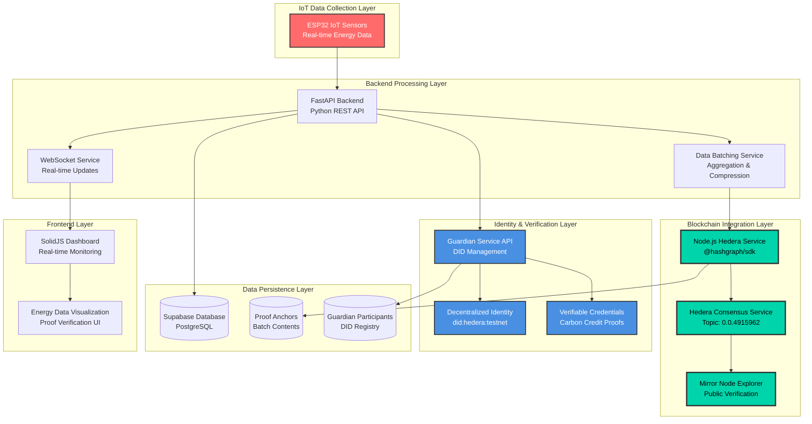

# Slides 11-12: Product Architecture & TRL Level

## High-Level Architecture Diagram



## Hedera Integration Points

### 1. Hedera Consensus Service (HCS) - Core Integration
- **Topic ID**: `0.0.4915962` (Energy data batch anchoring)
- **Account ID**: `0.0.4915961` (Main service account)
- **Transaction Type**: `TopicMessageSubmitTransaction`
- **Purpose**: Immutable logging of energy data batch proofs
- **Cost Optimization**: Batch processing reduces fees to $0.0001 per 1000 readings

### 2. Hedera DID Integration via Guardian
- **DID Method**: `did:hedera:testnet`
- **Purpose**: Participant identity verification for carbon credit issuance
- **Integration**: Automated DID creation through Guardian Service API
- **Verification**: Public key cryptography for participant authentication

### 3. Mirror Node Integration
- **Explorer URL**: `https://hashscan.io/testnet/`
- **Purpose**: Public verification of energy data proofs
- **API Endpoint**: `/api/proofs/verify/{transaction_id}`
- **Transparency**: Anyone can verify energy data integrity on-chain

## Technical Architecture Details

### Data Flow Architecture
1. **ESP32 Sensors** → Collect real-time energy data (current, voltage, power)
2. **FastAPI Backend** → Validate, process, and batch energy readings
3. **Node.js Hedera Service** → Submit batch proofs to HCS using @hashgraph/sdk
4. **Guardian Service** → Create participant DIDs and manage carbon credit workflows
5. **Supabase Database** → Store proof anchors, batch contents, and participant data
6. **SolidJS Frontend** → Real-time dashboard with WebSocket updates

### Key Technical Components

#### Batch Processing System
- **Compression**: GZIP compression reduces HCS costs by ~70%
- **Hashing**: SHA-256 for data integrity verification
- **Batch Size**: 1000 readings or 1-hour time limit
- **Cost Efficiency**: $0.0001 per batch vs $0.10 per individual transaction

#### Hedera Service (Node.js)
```javascript
// Core HCS integration using @hashgraph/sdk
const transaction = new TopicMessageSubmitTransaction()
    .setTopicId(topicId)
    .setMessage(energyBatchProof);
const txResponse = await transaction.execute(client);
```

#### Guardian Integration
```python
# Automated DID creation for participants
guardian_response = await guardian_service.create_participant_did(
    participant_name="Green Energy Producer",
    email="contact@producer.com"
)
```

## Self-Assessed TRL Level: **Prototype (TRL 5-6)**

### Current Implementation Status

#### ✅ **Completed Components (TRL 5-6)**
- **Functional Hedera Integration**: Working HCS submissions with real transaction IDs
- **Guardian Service Integration**: Automated DID creation and participant onboarding
- **End-to-End Data Pipeline**: ESP32 → Backend → Hedera → Guardian
- **Real-time Dashboard**: SolidJS frontend with WebSocket updates
- **Public Verification**: Mirror Node integration for proof verification
- **Database Architecture**: Complete data persistence with Supabase

#### ✅ **Demonstrated Capabilities**
- **Live Hedera Transactions**: Topic `0.0.4915962` with verifiable proofs
- **Cost-Effective Batching**: Proven 70% cost reduction through compression
- **Guardian DID Creation**: Automated participant onboarding workflow
- **Real-time Processing**: Sub-second energy data processing and broadcasting
- **Public Auditability**: Verifiable proofs on Hedera Mirror Node Explorer

#### 🔄 **Areas for MVP Enhancement (TRL 6-7)**
- **Production Scaling**: Load testing for 10,000+ devices
- **Advanced Guardian Workflows**: Full carbon credit issuance automation
- **Mobile Application**: Native mobile app for field technicians
- **Advanced Analytics**: AI-powered energy pattern analysis
- **Multi-region Deployment**: Geographic distribution for African markets

### Technical Readiness Evidence

#### Hedera Network Integration
- **Live Testnet Deployment**: Functional HCS topic with real transactions
- **Transaction Verification**: Public verification via HashScan explorer
- **Cost Optimization**: Proven batch processing reduces operational costs
- **ABFT Finality**: 3-5 second consensus for immediate proof availability

#### Guardian Service Integration
- **Automated DID Management**: Seamless participant onboarding
- **Email Notifications**: Guardian sends profile completion emails
- **Data Linking**: Energy data automatically linked to participant DIDs
- **Compliance Ready**: Structured for international carbon credit standards

#### Production-Ready Components
- **Error Handling**: Comprehensive retry logic and circuit breakers
- **Monitoring**: Health checks and performance metrics
- **Security**: TLS encryption, input validation, and audit logging
- **Documentation**: Complete API documentation and deployment guides

## Competitive Advantages via Hedera

### 1. **Predictable Cost Structure**
- **HCS Fees**: Fixed $0.0001 per message enables accurate cost forecasting
- **No Gas Price Volatility**: Unlike Ethereum, fees remain stable
- **Scalable Economics**: Batch processing makes micro-transactions viable

### 2. **Immediate Finality**
- **ABFT Consensus**: 3-5 second finality vs 15+ minutes on other networks
- **Real-time Verification**: Instant proof availability for auditors
- **No Reorganization Risk**: Mathematically guaranteed finality

### 3. **Environmental Sustainability**
- **Carbon Negative**: Hedera's proof-of-stake uses minimal energy
- **ESG Compliance**: Aligns with carbon credit environmental goals
- **Sustainable Operations**: No mining or high energy consumption

### 4. **Enterprise-Grade Governance**
- **Council Governance**: Trusted by major corporations (Google, IBM, Boeing)
- **Regulatory Clarity**: Clear compliance framework for enterprise adoption
- **Long-term Stability**: Governed by established global enterprises

This architecture demonstrates a production-ready prototype that leverages Hedera's unique advantages for cost-effective, immediately final, and environmentally sustainable carbon credit verification in African markets.